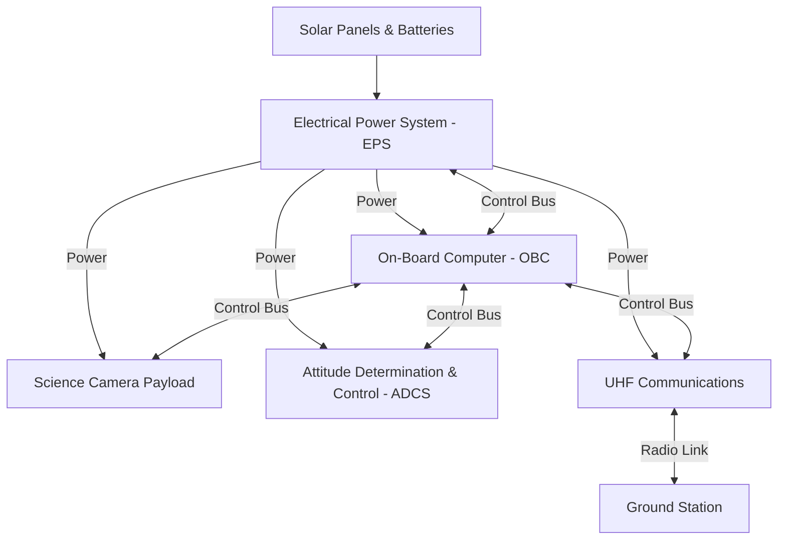

# Oregon State University (OSU) AIAA OSUSat/SCRT Climate Science CubeSat

Welcome to the central repository for the **OSUSat Climate Science CubeSat** project. This repository contains the hardware designs, firmware, and documentation for the sub-systems comprising the satellite.

---

## Mission Context & Goals

The **OSUSat Climate Science CubeSat** is a low-Earth orbit (LEO) satellite designed to capture high-resolution imagery and scientific data for climate science research. 

### Mission Objectives

1. **Earth Observations**: Capture multispectral or high-resolution imagery using a dual-camera payload to study surface health, atmospheric conditions, cloud formations.
2. **Reliable Power Delivery (EPS)**: Harvest solar power from 6 body-mounted solar panels, manage charge for 4x 18650 Li-ion batteries, and distribute and regulate power rails to prevent overcurrent/overvoltage events.
3. **Command & Telemetry (OBC)**: Orchestrate system operations, manage communication buses (CANBus, UART, I2C, SPI), process ground commands, and monitor satellite health.

---

## System Architecture

The satellite is divided into five primary subsystems interconnected via a shared backplane connector (exposing power rails and UART/CAN control buses):



### 1. Electrical Power System (EPS)

* **Microcontroller**: NXP S32K3 Series / STM32L496xx (ARM Cortex-M4)
* **Responsibilities**:
    * Solar energy harvesting with Maximum Power Point Tracking (MPPT).
    * Battery charge/discharge management (2 independent packs of 2x 18650 cells).
    * Voltage regulation (3.3V & 5V rails) with software-controllable load switches.
    * Fast hardware-level and software-level overcurrent protection.
    * Hardware watchdog monitoring.
    * Broad mission context management using the MCU


### 2. On-Board Computer (OBC)

* **Microcontroller**: Main MCU + STM32H743xx (ARM Cortex-M7)
* **Responsibilities**:
    * Master command parsing and state management.
    * Health heartbeats and telemetry collection.
    * Orbital calculations and scheduling payload imaging windows.
    * Ground station radio communication interface.

### 3. Payload

* **Processor**: Raspberry Pi Compute Module 4 (CM4)
* **Responsibilities**:
    * High-speed dual-camera scientific imaging.
    * Actuator/motor driver control (e.g., lens shutters, filter wheels) (V1 Only).
    * Image compression and storage before downlink.

### 4. Attitude Determination and Control System (ADCS)

* **Responsibilities**: Detumbling the spacecraft, aligning the imaging payload to nadir pointing, and tracking target orientations.

### 5. UHF Communications (Comms)

* **Responsibilities**: Uplinking commands and telemetry requests from ground stations, and downlinking collected science data and telemetry beacons.

---

## Repository Structure

The project uses a versioned directory structure separating hardware and firmware iterations:

```
.
├── .github/                     # GitHub Workflows & Issue/PR Templates
│   └── workflows/
│       ├── build_and_docs.yml   # CI/CD action defining the pipeline
│       └── build_and_test.sh    # Dynamic build script runner
│
├── adcs/                        # Attitude Determination and Control System
│   ├── v1/
│   └── v2/
│
├── eps/                         # Electrical Power System Subsystem
│   ├── v1/                      # Version 1 (Prototype Model)
│   │   ├── firmware/            # STM32L4 firmware (CMake, CUnit tests, mocks)
│   │   ├── hardware/            # KiCad schematic, layout, symbols, & footprints
│   │   └── documentation/       # Doxygen, Sphinx configuration & spec files
│   ├── v2/                      # Version 2 (Placeholder for v2 development)
│   └── documentation/           # Bootflows, subsystem specifications, & kickoff info
│
├── obc/                         # On-Board Computer Subsystem
│   ├── v1/                      # Version 1 (Prototype Model)
│   │   ├── firmware/            # STM32H7 firmware (CMake)
│   │   ├── hardware/            # KiCad schematic and layout
│   │   └── tests/               # Pico-based LoRa packet transmission test
│   ├── v2/                      # Version 2 (Placeholder for v2 development)
│   └── documentation/           # OBC specific documentation
│
├── payload/                     # Science Camera Payload
│   ├── v1/                      # Version 1 (Prototype Model)
│   │   └── hardware/            # KiCad CM4 baseboard schematic and layout
│   ├── v2/                      # Version 2 (Placeholder for v2 development)
│   └── documentation/           # Payload specific documentation
│
├── comms/                       # UHF Communications Subsystem (Planned)
│   ├── v1/
│   └── v2/
│
└── documentation/               # Global guidelines & Quality Assurance process
    ├── checklists/              # Bringup, layout, schematic & firmware service templates
    └── design_guidelines/       # Writing ATPs, Hardware Design, HITL, Polling/Interrupts
```

---

## Getting Started & Building

### 1. Prerequisite Toolchains

Ensure you have the following installed on your host system:
* **ARM Cross Compiler**: `gcc-arm-none-eabi`
* **Build System Tools**: `cmake`, `make`, `g++`
* **Documentation Generators**: `doxygen`, Python 3 + `sphinx`

### 2. Fetching Submodules

This repository utilizes submodules (such as `osusat/core` and `osusat/messaging`). Clone with submodules or initialize them:
```bash
git submodule update --init --recursive
```

### 3. Compilation Guide

#### Building for the ARM Target (e.g., EPS v1)

To build the firmware binaries to flash onto the MCU:

```bash
cd eps/v1/firmware
cmake -B build_arm -S . -DCMAKE_TOOLCHAIN_FILE=arm-none-eabi-toolchain.cmake
cmake --build build_arm
```

*Outputs: `.elf`, `.hex`, and `.bin` files will be generated under `build_arm/`.*

#### Building Host Tests / Hardware-in-the-Loop (HITL) Mocks

To build and execute unit tests on your local machine:

```bash
cd eps/v1/firmware
cmake -B build_hitl -S . -DTARGET_ARCH=HOST -DBUILD_HITL=ON
cmake --build build_hitl
cd build_hitl && ctest --output-on-failure
```

---

## CI/CD Pipeline

The repository uses a generalized GitHub Actions workflow:
* **Scope-Based Execution**: Uses git diffs to detect which subsystem version has been modified (e.g. `eps/v1/` vs `obc/v1/`) and builds only the affected firmware.
* **Continuous Integration**: Runs host-based CTests automatically to verify changes.
* **Documentation Deployments**: Generates Doxygen API listings and Sphinx documentation on successful builds. Pull Requests automatically receive a comment with links to Pages-hosted previews of the documentation.

---

## Quality Assurance & Contributions

Before submitting a Pull Request, contributors must follow the project's QA procedures found in `/documentation`:

1. **Issue Checkout:** Before work or contributions begin, ensure your changes are encapsulated by an issue in the GitHub project
2. **Design Guidelines:** For any and all changes, follow the [design guidelines.](./documentation/design_guidelines/)
3. **Design Reviews**: Complete the [Schematic Review Checklist](./documentation/checklists/schematic_review.md) and [Layout Review Checklist](./documentation/checklists/layout_review.md) checklists before fabricating PCBs.
4. **Firmware Guidelines**: Adhere to the [HITL Guidelines](./documentation/design_guidelines/hitl.md) and [Keeping the HAL Policy Free](./documentation/design_guidelines/keeping_the_hal_policy_free.md) design rules.
5. **Acceptance Tests**: All hardware deliverables require a formal [ATP (Acceptance Test Procedure)](./documentation/design_guidelines/writing_atps.md).
